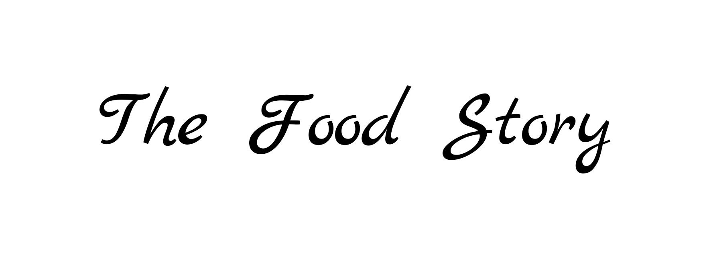

  
  <b><em>A Social Platform for sharing and learning food recipes!</em></b>
   
  Made with Flutter❤
   
   
  
  
   
  
   
   
   
  Want to show everyone your cooking skills? 🍽 
   
  <em>Jump In</em>
   
   
  <b> 🌿   Plating 🌿 </b>
   
   
  
   
   
  Liked it? <b>🌟 it!</b> 
   
  Loved it? <b>Contribute!</b>
   
  How you ask?
   
   
  <a href="https://github.com/Tushar-OP/The_Food_Story/blob/master/CONTRIBUTION.md">--- Contribution Guide ---</a>
   
   
  Cheers!✨

